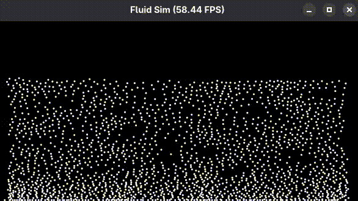

Perfeito — vou atualizar seu README mantendo sua estrutura original, mas agora refletindo que você já está usando **SPH baseado em densidade (WCSPH)** com:

- cálculo real de densidade
- equação de estado
- força de pressão simétrica
- viscosidade via Laplaciano
- spatial hashing

Segue a versão atualizada:

---

# 2D Particle Fluid Simulation (Taichi)

A real-time GPU-accelerated 2D particle-based **SPH fluid simulation** built with **Taichi (Python)**.

The simulation runs on Taichi’s cross-platform GPU backend, automatically targeting **CUDA, Vulkan, Metal, or DX12** depending on the system.

This project evolved from a naive O(n²) pairwise interaction model to a spatially partitioned system using a **uniform grid (spatial hashing)**, and later into a density-based **Weakly Compressible SPH (WCSPH)** solver.

---

## Demo

### v0.4 — Density-Based SPH (WCSPH)



---

## Features

- Cross-platform GPU acceleration (CUDA / Vulkan / Metal / DX12 via Taichi)
- Semi-implicit Euler integration
- Gravity force
- Density computation using smoothing kernel
- Equation of State pressure model (WCSPH)
- Symmetric pressure force formulation (ρ² form)
- Viscosity force using Laplacian kernel
- Boundary constraints with energy loss
- Uniform grid spatial hashing (3×3 neighbor lookup)
- 5,000+ particles in real time

---

## Simulation Model

The solver implements **Weakly Compressible Smoothed Particle Hydrodynamics (WCSPH)**.

### Density Computation

Particle density is computed as:

[
\rho_i = \sum_j m_j W(r_{ij}, h)
]

Using a Poly6-style smoothing kernel.

---

### Pressure Equation

Pressure is computed using the equation of state:

[
P_i = k(\rho_i - \rho_0)
]

Where:

- ( k ) → gas constant (stiffness)
- ( \rho_0 ) → rest density

---

### Symmetric Pressure Force

To improve stability and physical correctness:

[
F_i = - \sum_j m_j
\left(
\frac{P_i}{\rho_i^2} +
\frac{P_j}{\rho_j^2}
\right)
\nabla W
]

This prevents asymmetric force artifacts and improves incompressibility behavior.

---

### Viscosity Force

Viscosity is computed using the Laplacian of the smoothing kernel:

[
F_{visc} \propto (\mathbf{v}_j - \mathbf{v}_i) \nabla^2 W
]

This stabilizes particle velocities and reduces jitter.

---

## Performance Evolution

### v0.2 — Naive Pairwise Interaction

All particles interact with each other:

O(n²)

Limited scalability (~2000 particles).

---

### v0.3 — Spatial Hashing (Uniform Grid)

Particles are inserted into grid cells based on position.
Each particle checks only neighbors inside its own cell and surrounding 8 cells.

Average complexity:

O(n · k)

Where **k** is the average number of particles per cell (bounded).

Enabled stable real-time simulation with 5000+ particles.

---

### v0.4 — Density-Based SPH Solver

Replaced heuristic spring + cohesion forces with:

- Physically motivated density computation
- Pressure forces derived from equation of state
- Proper viscosity model
- Improved liquid-like behavior

This version moves closer to a physically consistent fluid solver.

---

## Technical Highlights

- GPU parallel kernels via Taichi
- Atomic grid insertion
- Data-oriented design (SoA layout)
- Spatial hashing for neighbor search
- Density-based force accumulation
- Clear separation between:
  - Spatial partitioning
  - Density & pressure computation
  - Force accumulation
  - Integration step

---

## How to Run

```bash
pip install taichi
python FILE_NAME.py
```

---

## Note

The original O(n²) pairwise implementation remains in the repository for performance comparison and architectural reference, showing the evolution from heuristic particle forces to a structured SPH-based fluid solver.
